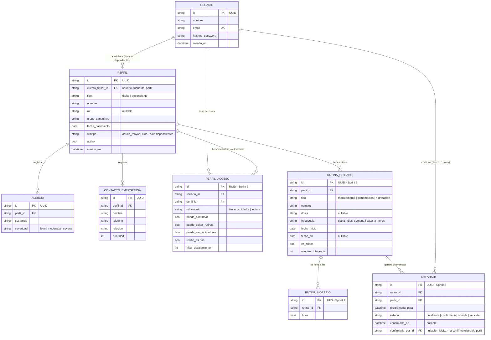

# Modelo de Datos — Perfil Médico+

**Responsable:** Sergio Ocares · **Sprint 1** (S5-S6)

## Diagrama entidad-relación

Las tablas marcadas como "Sprint 1" son las que se implementan en este sprint (ver `Aplicación/backend/app/models/`). Las demás se muestran para dar contexto de hacia dónde va el modelo completo — se implementan en los sprints indicados, no en este.

## Decisiones de diseño

- **UUID como llave primaria** (en vez de un entero autoincremental): evita que alguien adivine IDs secuenciales de otros usuarios en la URL de la API, algo relevante al tratarse de datos de salud.

- **`USUARIO` es la credencial; `PERFIL` es la persona.** El titular también tiene su propio registro en `PERFIL` (con `tipo = 'titular'`), y los familiares a su cargo son perfiles adicionales de la misma cuenta. Esto es lo que permite que el titular registre medicamentos y rutinas **para sí mismo** (HU 4 del Product Backlog y objetivo general del proyecto), sin tener que crearse un "perfil dependiente de sí mismo". Como efecto secundario, si mañana un dependiente pasa a administrar su propia cuenta, solo cambia el `tipo`: no hay que migrar sus rutinas ni su historial. Regla: una cuenta tiene exactamente un perfil titular (índice único parcial sobre `cuenta_titular_id WHERE tipo = 'titular'`).

- **Todo cuelga de `PERFIL`, no de `PERFIL_DEPENDIENTE`.** Rutinas, alergias, contactos de emergencia, indicadores y alertas apuntan a `perfil_id`. Así cada módulo se escribe una sola vez y funciona igual para el titular y para un dependiente, en lugar de duplicar la lógica según de quién se trate.

- **`ACTIVIDAD` separada de `RUTINA_CUIDADO`: la decisión más importante del modelo.** La rutina es la *indicación* ("1 comprimido a las 08:00 todos los días"); la actividad es cada *ocurrencia concreta* en una fecha y hora, generada por un job del backend con 24-48 h de anticipación. Es indispensable porque una confirmación que apunta directo a la rutina solo registra lo que sí ocurrió: si no hay fila, no se puede distinguir entre "no se tomó el medicamento" y "nunca se programó esa toma". Y sin poder afirmar que una toma estaba programada y no se confirmó, no existen las alertas escalonadas (HU 10), el % de cumplimiento (HU 13) ni el flujo Monitorear → Alertar del proyecto. Un `UNIQUE (rutina_id, programada_para)` evita ocurrencias duplicadas si el job se ejecuta dos veces.

- **Confirmación por proxy sin campo booleano:** en vez de `fue_proxy`, se usa `confirmada_por_id`. Si viene NULL, confirmó el propio perfil desde la interfaz simplificada; si trae un usuario, confirmó un cuidador *y además queda registrado cuál* — información que el booleano perdía y que el historial de cumplimiento necesita.

- **`PERFIL_ACCESO` como tabla intermedia (no un campo simple):** un cuidador puede estar vinculado a más de un perfil, y un perfil puede tener más de un cuidador — es una relación muchos-a-muchos, con permisos configurables por cada vínculo (objetivo específico 3 del 1.5). Incluye `nivel_escalamiento`, que define el orden en que se notifica a los cuidadores cuando una actividad no se confirma.

- **Sin campo `rol` global en `USUARIO`:** ser cuidador no es un atributo de la persona sino del vínculo, y ese vínculo ya vive en `PERFIL_ACCESO`. La misma persona es titular de su cuenta y, al mismo tiempo, cuidadora del perfil de su madre; un campo global obligaría a elegir uno de los dos valores y generaría inconsistencias. Se mantiene el criterio original de no crear una tabla de roles del sistema —sería sobre-ingeniería para el alcance— pero el rol se resuelve por vínculo, no por usuario.

- **Permisos como columnas booleanas, no como JSON:** el panel de gestión (HU 8) y el motor de alertas (HU 10) necesitan consultas del tipo "todos los cuidadores de este perfil que reciben alertas, ordenados por nivel". Con columnas eso es un índice; con un string JSON obliga a traer todas las filas y filtrarlas en Python.

- **`RUTINA_HORARIO` como tabla, en vez de un string tipo cron:** una rutina diaria puede tener tres tomas. Con horas en una tabla, la consulta "qué actividades corresponden hoy" se resuelve en SQL; con una expresión cron guardada como texto, habría que interpretarla en el backend para cada rutina de cada perfil.

- **Datos clínicos base del perfil (HU 2):** RUT, grupo sanguíneo, alergias y contactos de emergencia son parte del Sprint 1 y están marcados como prioridad Alta. Alergias y contactos van en tablas propias porque son listas de largo variable: una persona puede tener tres alergias y dos contactos.

## Estado por sprint

| Tabla | Sprint | Estado |
|---|---|---|
| `usuarios` | Sprint 1 | Implementada (migración Alembic `22222d1ae8f4`) — requiere nueva migración para eliminar la columna `rol` |
| `perfiles` | Sprint 1 | Pendiente |
| `alergias`, `contactos_emergencia` | Sprint 1 | Pendiente |
| `rutinas_cuidado`, `rutinas_horario`, `actividades` | Sprint 2 | Pendiente |
| `perfil_acceso` | Sprint 3 | Pendiente |

## Cambios respecto de la versión anterior del documento

1. Se separó `USUARIO` (credencial) de `PERFIL` (persona), eliminando `PERFIL_DEPENDIENTE` como tabla aparte — el titular quedaba sin poder tener rutinas propias.
2. Se agregó `ACTIVIDAD` entre la rutina y su confirmación, sin la cual no se pueden detectar actividades no confirmadas.
3. Se agregaron los datos clínicos base del perfil (HU 2, Sprint 1), que no estaban modelados.
4. Se eliminó el campo `rol` de `USUARIO`, reemplazado por `rol_vinculo` en `PERFIL_ACCESO`.
5. Menores: permisos como booleanos en vez de JSON, horarios en tabla propia en vez de string cron, `confirmada_por_id` en vez de `fue_proxy`.
